## Welcome to Innocent Dema's homepage!

Check **2ms** on Google Play (Coming Soon)

### [Android Basics Nanodegree projects(Schorlarship by Google/Udacity)](https://confirm.udacity.com/3XDREDPM)

All these projects have been reviewed by Google/Udacity Android Apps Professionals.

### 1. Project 07 : [Inventory App (Database)](https://github.com/angwandi/Books) 

#### Learnings: 
* Creating a SQLite table in your app
* Populating that table with new entries
* Modifying the entries
* Displaying the contents of the table to users.
* Storing information in a SQLite database
* Integrating Android’s file storage systems into that database
* Setting up a Content Provider and use it to access a repository of data
* Presenting information from files and SQLite databases to users
* Updating information based on user input
* Creating intents to other apps using stored information

#### [Demo Video](https://www.youtube.com/watch?v=JlT3Z2kI5RE&t=4s)

#### Screenshots :

Main Screen | Settings  | Add a book | Validation | Validation | Book saved |  
:---------: | :-------: | :---------: | :---------:| :---------:| :---------:| 
 |  |  |  | 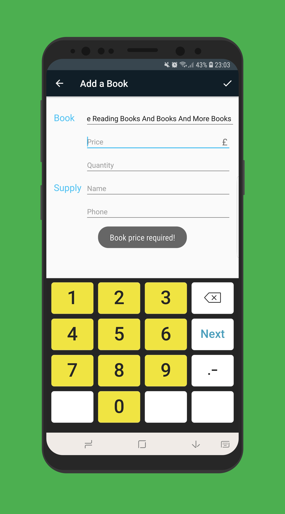 | 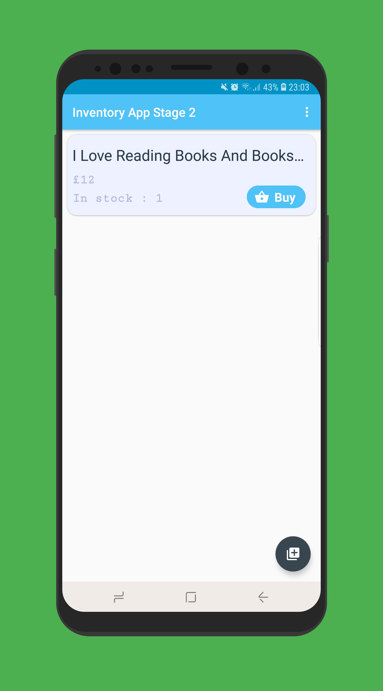 

Buy clicked | Instock = 0 | More books | Details Screen | Plus Clicked | Minus Clicked | 
:----------:| :----------:| :---------:| :-------------:| :-----------:| :------------:|
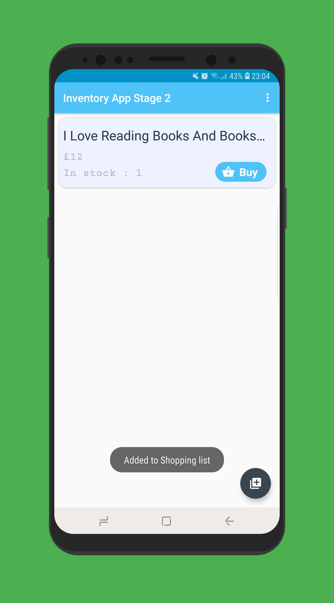 | 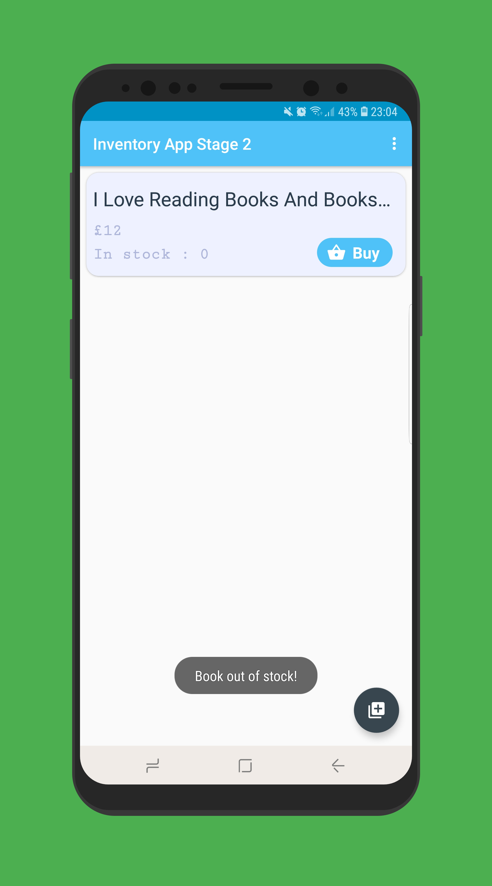 | 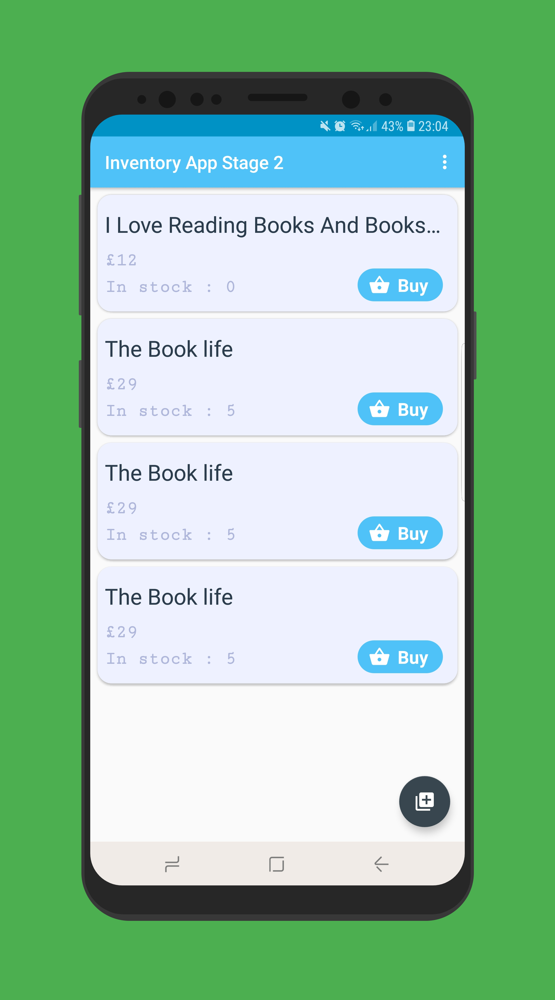 | 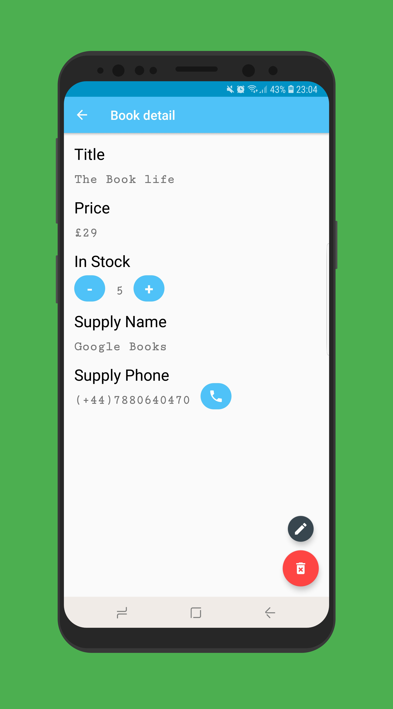 | 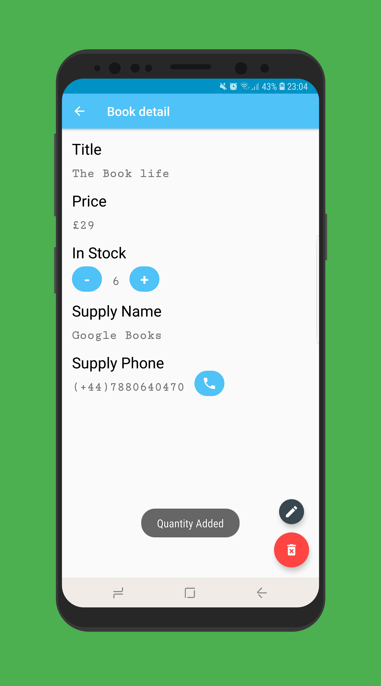 |   

 Instock = 0 | Delete Clicked | Edit Screen | Validation | Back Pressed |
 :----------:| :-------------:| :----------:| :---------:| :-----------:|
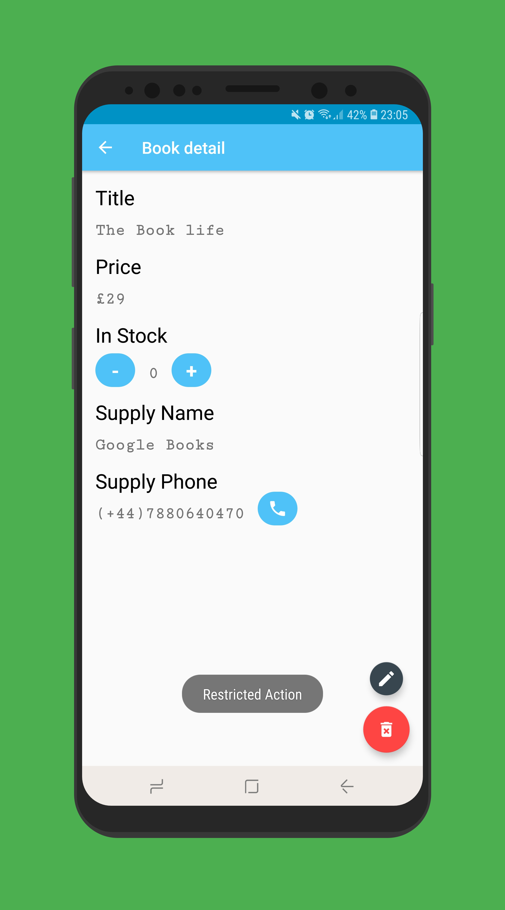 | 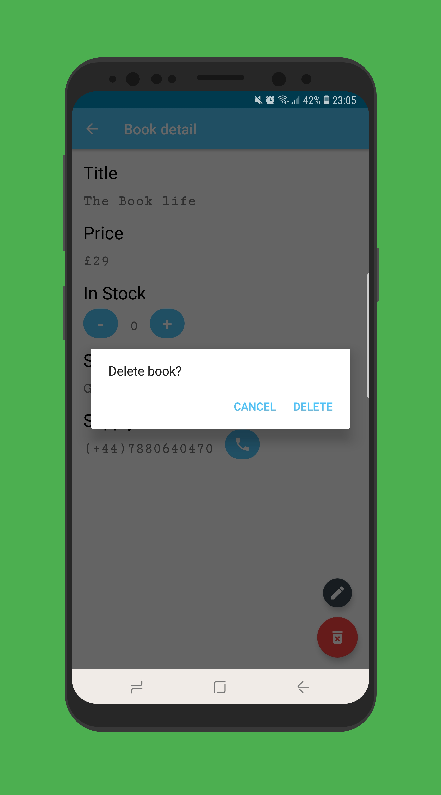 |  | 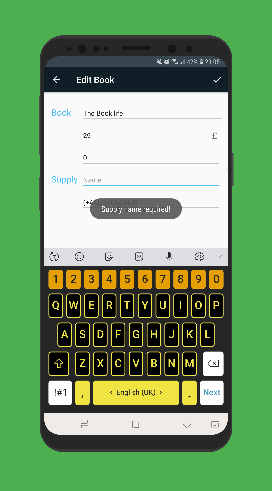 | 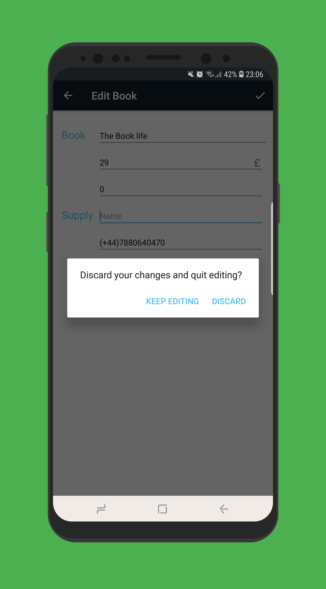 

### 2. Project 06 : [NewsApp (Networking)](https://github.com/angwandi/NewsAppABNSGU) 

#### Learnings: 
* Connecting to an API
* Parsing the JSON response
* Handling error cases gracefully
* Updating information regularly
* Using an AsyncTask
* Doing network operations independent of the Activity lifecycle
* Implement the Preference Fragment
* Launch a Settings Activity from a menu in the Main Activity
* Use Uri.Builder class to add query parameters to the URL
* Update and display the Preference Summary

#### [Demo Video](https://www.youtube.com/watch?v=oA2RqZK7JZo&t=43s)

#### Screenshots :

Main Screen | Settings | Settings Screen | Preference 
:---------: | :------: | :-------------: | :--------: 
 |  |  |  
Preference | MS/Preference | No Internet Screen | Empty Screen 
:--------: | :-----------: | :----------------: | :----------:  
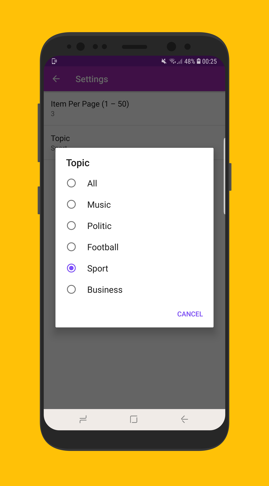 | 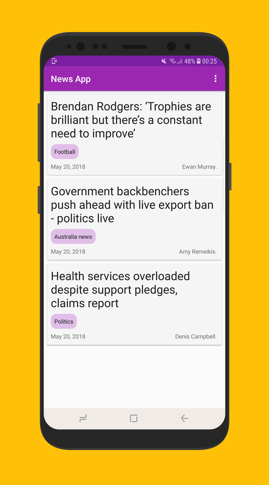 | 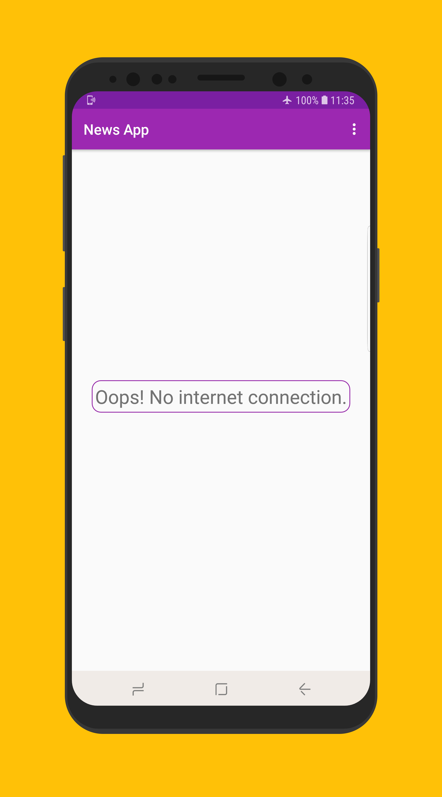 | 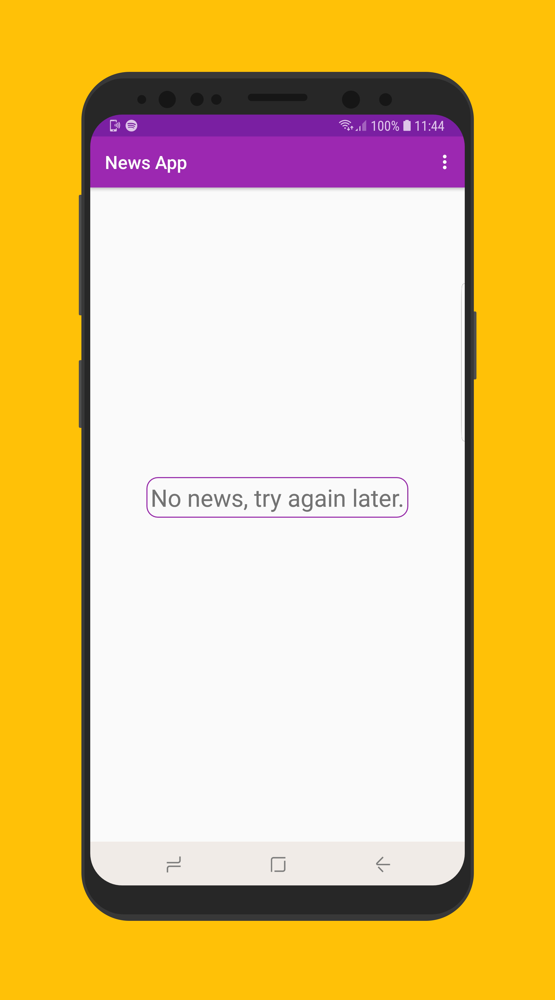 

### 3. Project 02 : [(Score Keeper App)](https://github.com/angwandi/ScoreKeeperABNSG) 

#### Learnings: 
* Adding button code to your app
* Updating views
* Properly scoping variables
* Finding views by their ID
* Handle screen configuration changes using **ViewModel**

#### [Demo Video](https://www.youtube.com/watch?v=UePwKT9s5Fk&feature=youtu.be)

#### Screenshots :

Screen 1 | Screen 2
------------ | -------------
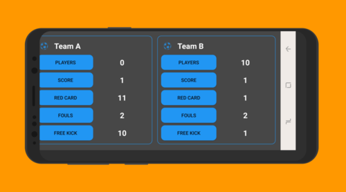 | 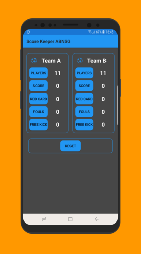
Screen 3 | Screen 4
 | 

> Made by 2ms

