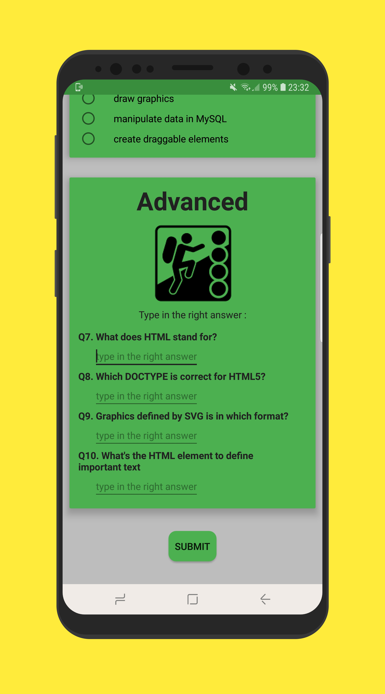

## Welcome to Innocent Dema's developer profile!

## Tech Stack
### Frontend:
* Flutter for Android and iOS (All flutter supported plarforms)
* Android for Android Native developement
* Vue.js for web developement 

### Backend
* Firebase (All product)
* MongoDB,  Node.js, Express for fast best of class API developement
* SQL for database (Focusing on Azure SQL)

## Working on more projects privately. Disclosed per request(Might need to sign an NDA).

### [Android Basics Nanodegree projects(Schorlarship by Google/Udacity)](https://confirm.udacity.com/3XDREDPM)

All these projects have been reviewed by Google/Udacity Android Apps Professionals.

#

### 1. Project 07 & 08 : [Inventory App (Database)](https://github.com/angwandi/Books) 

#### Learnings: 
* Creating a SQLite table in your app
* Populating that table with new entries
* Modifying the entries
* Displaying the contents of the table to users.
* Storing information in a SQLite database
* Integrating Android’s file storage systems into that database
* Setting up a Content Provider and use it to access a repository of data
* Presenting information from files and SQLite databases to users
* Updating information based on user input
* Creating intents to other apps using stored information

#### [Demo Video](https://www.youtube.com/watch?v=JlT3Z2kI5RE&t=4s)

#### Screenshots :

Main Screen | Settings  
:---------: | :-------: 
 |  
Add a book | Validation | 
 |  

#

### 2. Project 06 (2 parts) : [NewsApp (Networking)](https://github.com/angwandi/NewsAppABNSGU) 

#### Learnings: 
* Connecting to an API
* Parsing the JSON response
* Handling error cases gracefully
* Updating information regularly
* Using an AsyncTask
* Doing network operations independent of the Activity lifecycle
* Implement the Preference Fragment
* Launch a Settings Activity from a menu in the Main Activity
* Use Uri.Builder class to add query parameters to the URL
* Update and display the Preference Summary

#### [Demo Video](https://www.youtube.com/watch?v=oA2RqZK7JZo&t=43s)

#### Screenshots :

Main Screen | Settings 
:---------: | :------: 
 |  
 Settings Screen | Preference
 |  

#

### 3. Project 05 : [(Tour Guide App)](https://github.com/angwandi/UxbridgeTourGuideAppABNSGU) 

#### Learnings: 
* Planning your app design and navigation before coding
* Selecting proper data structures to store lists of information
* Building layouts to display those lists of data
* Navigating between lists in Fragments using either a ViewPager plus TabLayout or Navigation Drawer*
* Creating your own custom classes
* Properly handling images or audio (if applicable)
  * **Navigation Drawers** were not covered in this course, but you may choose to implement it in this app.

#### [Demo Video](https://www.youtube.com/watch?v=MNp5X1No4Ts&t=25s)

#### Screenshots :

Nav Drawer | ND Dtl Scr | RecyclerView
:-------:| :-------:| :------:
 |  | 

RCV Detail Scr | App Bar
:-------------:| :-----:
 |  

#

### 4. Project 04 : [(Music Player Structure App)](https://github.com/angwandi/MusicalStructureAppABSNGU) 

#### Learnings: 
* Designing an app experience to achieve a certain goal
* Creating new activities
* Using explicit Intents to link between activities in your app
* Using OnClickListeners to add behavior to buttons using Java code.
* Creating your own Custom Class
* Looping through an ArrayList
* Populating a ListView or GridView with an ArrayAdapter

#### Screenshots :

Screen 1 | Screen 1 | Screen 1
:-------:| :-------:| :------:
 |  | 
Screen 1 | Screen 1 | Screen 1
 |  | 

#

### 5. Project 03 : [(Quiz App)](https://github.com/angwandi/QuizAppABNSGU) 

#### Learnings: 
* Planning your app design before coding.
* Taking an app layout from drawing to XML code.
* Creating, positioning, and styling views.
* Creating interactivity through button clicks and Java code.
* Commenting and documenting your code.

#### Screenshots :

Screen 1 | Screen 1 | Screen 1
:-------:| :-------:| :------:
 |  | 
Screen 1 | Screen 1 | Screen 1
 |  | 

#

### 6. Project 02 : [(Score Keeper App)](https://github.com/angwandi/ScoreKeeperABNSG) 

#### Learnings: 
* Adding button code to your app
* Updating views
* Properly scoping variables
* Finding views by their ID
* Handle screen configuration changes using **ViewModel**

#### [Demo Video](https://www.youtube.com/watch?v=UePwKT9s5Fk&feature=youtu.be)

#### Screenshots :

Main Screen | Points Added | Screen Config.
:----------:| :-----------:| :------------:
 |  | 

#

### 7. Project 01 : [(Single Screen App)](https://github.com/angwandi/SingleScreenApp) 

#### Project Overview
Design and implement a single screen app that displays information about a fictional small business. Think along the lines of your favorite coffeeshop, local restaurant, or that gem of a store that sells those rare comic books or records.

#### Requirements: 

Design must include:

* Business name
* At least one photo representing the business
* Two or more other pieces of information, such as:
* Contact information for the business (eg phone number, email address, website)
  * Address of the Business
  * Description of business
  * Hours of operation
  
#### [Demo Video](https://www.youtube.com/watch?v=EwJONpZgb9E)

#### Screenshots :

ScreenShot 01 | ScreenShot 02| ScreenShot 03
:------------:| :-----------:| :-----------:
 |  | 

#

> Made with lots of love by Innocent Dema

